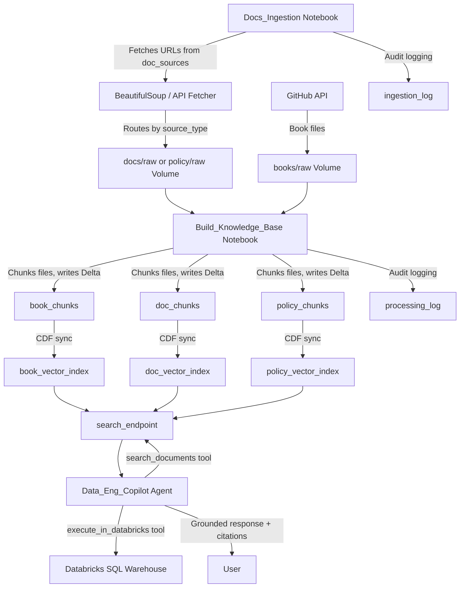

# Databricks AI Project

A documentation-grounded Data Engineering Copilot built on Databricks Free Edition. This project combines RAG (Retrieval-Augmented Generation), vector search, and agentic tool calling to create an intelligent assistant that retrieves grounded context from technical documentation, books, and organizational policy — and can generate and execute SQL with user confirmation.

---

## What It Does

- **Ingests and indexes** technical documentation (Databricks, Unity Catalog, Spark SQL), literary sources (via GitHub), and organizational policy files
- **Chunks and embeds** source content into Databricks Vector Search indexes using the `databricks-bge-large-en` embedding model
- **Routes queries** to the correct vector index based on source type (`books`, `docs`, or `policy`)
- **Generates grounded responses** using `databricks-meta-llama-3-3-70b-instruct`, citing the exact source file and page location
- **Executes SQL** with a multi-turn user confirmation step before committing
- **Logs all pipeline activity** to audit Delta tables for observability
- **Registered as a versioned MLflow model** in Unity Catalog with MLflow tracing enabled

---

## Architecture



---

## Project Structure

```
databricks-ai-project/
├── AI_Project                    # Original notebook, kept for reference
├── ingestion/
│   └── Docs_Ingestion            # Fetches URLs from doc_sources, lands files in Volume
├── processing/
│   └── Build_Knowledge_Base      # Chunks files, writes to Delta, syncs vector indexes
├── Agent/
│   ├── Data_Eng_Copilot          # Interactive notebook agent
│   ├── Data_Eng_Copilot_Agent.py # ResponsesAgent class for MLflow
│   └── Data_Eng_Copilot_Driver   # Logs and registers agent to MLflow/UC
└── utils/
    ├── logging_utils             # write_log(), write_ingestion_log(), deactivate_doc_source()
    ├── search_utils              # search_documents() with raw mode
    └── agent_tools               # execute_in_databricks(), clean_message()
```

### Volume Structure

```
raw_data/
├── books/
│   ├── raw/            # Source book files land here
│   └── processed/      # Processed files moved here automatically
├── docs/
│   ├── raw/            # Fetched documentation files land here
│   └── processed/      # Processed files moved here automatically
└── policy/
    ├── raw/            # Policy files land here
    └── processed/      # Processed files moved here automatically
```

### SQL Structure

```
SQL/
├── DDL/
│   ├── ai_project.sql
│   ├── raw_data.sql
│   └── Tables/
│       ├── book_chunks.sql
│       ├── doc_chunks.sql
│       ├── policy_chunks.sql
│       ├── processing_log.sql
│       ├── doc_sources.sql
│       ├── ingestion_log.sql
│       ├── foundations.sql
│       └── source_config.sql
└── DML/
    ├── populate_doc_sources.sql
    ├── populate_foundations.sql
    └── populate_source_config.sql
```

---

## Unity Catalog Objects

| Object | Type | Description |
|--------|------|-------------|
| `workspace.ai_project` | Schema | Project schema |
| `workspace.ai_project.raw_data` | Volume | File storage for books, docs, and policy |
| `workspace.ai_project.book_chunks` | Delta Table | Chunked text from book sources |
| `workspace.ai_project.doc_chunks` | Delta Table | Chunked text from documentation |
| `workspace.ai_project.policy_chunks` | Delta Table | Chunked text from policy files |
| `workspace.ai_project.processing_log` | Delta Table | Audit log for file → chunk processing |
| `workspace.ai_project.ingestion_log` | Delta Table | Audit log for URL fetching |
| `workspace.ai_project.doc_sources` | Delta Table | Registry of external URLs to ingest |
| `workspace.ai_project.foundations` | Delta Table | Global config (catalog, schema, models, endpoint) |
| `workspace.ai_project.source_config` | Delta Table | Per-source-type config (paths, tables, indexes) |
| `workspace.ai_project.data_eng_copilot` | UC Registered Model | Versioned MLflow model in Unity Catalog |
| `search_endpoint` | Vector Search Endpoint | Serves all vector indexes |
| `workspace.ai_project.book_vector_index` | Vector Search Index | Indexes book_chunks |
| `workspace.ai_project.doc_vector_index` | Vector Search Index | Indexes doc_chunks |
| `workspace.ai_project.policy_vector_index` | Vector Search Index | Indexes policy_chunks |

---

## Agent Tools

| Tool | Description |
|------|-------------|
| `search_documents` | Searches a vector index by source_type (`books`, `docs`, `policy`) |
| `execute_in_databricks` | Executes SQL after multi-turn user confirmation |

---

## MLflow / Unity Catalog Model

| Property | Value |
|----------|-------|
| Experiment | `/Users/sinc7train@gmail.com/Data_Eng_Copilot` |
| Registered Model | `workspace.ai_project.data_eng_copilot` |
| Framework | `mlflow.pyfunc.ResponsesAgent` |
| Tracing | `mlflow.openai.autolog()` enabled |
| Driver Notebook | `Agent/Data_Eng_Copilot_Driver` |

### Model Serving Endpoint

Deployment of the registered UC model to a Databricks Model Serving endpoint is currently **in progress**. The endpoint (`data-eng-copilot`) is configured with `scale_to_zero_enabled: True` and `workload_size: Small`.

> **Note:** Free Edition imposes authentication restrictions on serving container → foundation model API calls. Investigation into supported auth mechanisms for this configuration is ongoing.

---

## Setup Instructions

### Prerequisites

- Databricks Free Edition workspace
- Unity Catalog enabled
- Python packages (see `requirements.txt`)
- GitHub personal access token (stored in Databricks Secret scope `ai-project-secrets` as `github-token`)

### First Time Setup

1. **Clone the repository** into your Databricks workspace

2. **Run the DDL files** in order:
   ```sql
   -- 1. Create schema and volume
   SQL/DDL/ai_project.sql
   SQL/DDL/raw_data.sql

   -- 2. Create tables
   SQL/DDL/Tables/book_chunks.sql
   SQL/DDL/Tables/doc_chunks.sql
   SQL/DDL/Tables/policy_chunks.sql
   SQL/DDL/Tables/processing_log.sql
   SQL/DDL/Tables/doc_sources.sql
   SQL/DDL/Tables/ingestion_log.sql
   SQL/DDL/Tables/foundations.sql
   SQL/DDL/Tables/source_config.sql
   ```

3. **Populate config tables**:
   ```sql
   -- Run in order
   SQL/DML/populate_foundations.sql
   SQL/DML/populate_source_config.sql
   SQL/DML/populate_doc_sources.sql
   ```

4. **Create the Volume folder structure** manually in the Databricks UI:
   ```
   raw_data/books/raw/      raw_data/books/processed/
   raw_data/docs/raw/       raw_data/docs/processed/
   raw_data/policy/raw/     raw_data/policy/processed/
   ```

5. **Install dependencies**:
   ```python
   %pip install -r requirements.txt
   ```

---

## How to Run

### Ingesting Documentation

Run `ingestion/Docs_Ingestion` notebook top to bottom. It will:
- Query `doc_sources` for active URLs
- Fetch and clean each page (scrape or API based on `fetch_method`)
- Route files to the correct Volume folder based on `source_type`
- Log each fetch to `ingestion_log`

### Building the Knowledge Base

Run `processing/Build_Knowledge_Base` notebook top to bottom:
- Reads config from `foundations` and `source_config` Delta tables
- Chunks files and writes to the appropriate Delta table
- Syncs all vector indexes sequentially using `wait_until_ready()`

### Running the Interactive Agent

Run `Agent/Data_Eng_Copilot` notebook. This is the primary demo environment for the agent, including the multi-turn SQL confirmation flow.

### Registering the MLflow Model

Run `Agent/Data_Eng_Copilot_Driver` top to bottom:

| Cell | Description |
|------|-------------|
| Cell 1 | Install dependencies |
| Cell 2 | Set MLflow experiment and UC registry |
| Cell 3 | Log agent to MLflow |
| Cell 4 | Display logged model info |
| Cell 5 | (Skipped) — use Cell 6 to retrieve existing version |
| Cell 6 | Retrieve or register model version in UC |
| Cell 7 | Deploy to Model Serving endpoint |
| Cell 8 | Test endpoint with HTTP request |

---

## Example Agent Queries

```python
# Technical question (routes to doc_vector_index)
"What is the medallion architecture in Databricks?"

# Policy question (routes to policy_vector_index)
"What are the naming conventions for Delta tables?"

# Literary question (routes to book_vector_index)
"What weapon did Raskolnikov use to commit the crime?"

# SQL execution (searches policy first, then confirms before executing)
"Show me the 5 most recently processed files from the processing_log table."
```

---

## Tech Stack

| Component | Technology |
|-----------|-----------|
| Platform | Databricks Free Edition |
| Orchestration | Databricks Notebooks |
| Storage | Delta Lake + Unity Catalog Volumes |
| Chunking | LangChain RecursiveCharacterTextSplitter |
| Embeddings | databricks-bge-large-en |
| Vector Search | Databricks Mosaic AI Vector Search |
| LLM | databricks-meta-llama-3-3-70b-instruct |
| Agent Framework | mlflow.pyfunc.ResponsesAgent + manual tool loop |
| Model Registry | MLflow + Unity Catalog |
| Tracing | MLflow Tracing (autolog) |
| HTML Parsing | BeautifulSoup4 |
| SQL Execution | Databricks SDK Statement Execution API |

---

## Roadmap

- [ ] **Model Serving endpoint** — resolve Free Edition auth restrictions for serving container → foundation model API calls
- [ ] **Orchestration** — GitHub Actions + Databricks Workflows for scheduled ingestion
- [ ] **Usage tracking** — populate `usage` field in `ResponsesAgentResponse`
- [ ] **Data dictionary** — add to `reference-material-source` repo
- [ ] **Book files** — add to `reference-material-source` and ingest via GitHub API
- [ ] **README** — keep updated as project evolves
- [ ] **Phase 2** — create a separate catalog/schema with practice data pipelines, use the copilot to optimize them

---

## Author

Sean Incardona | [GitHub](https://github.com/seaninc-training)
