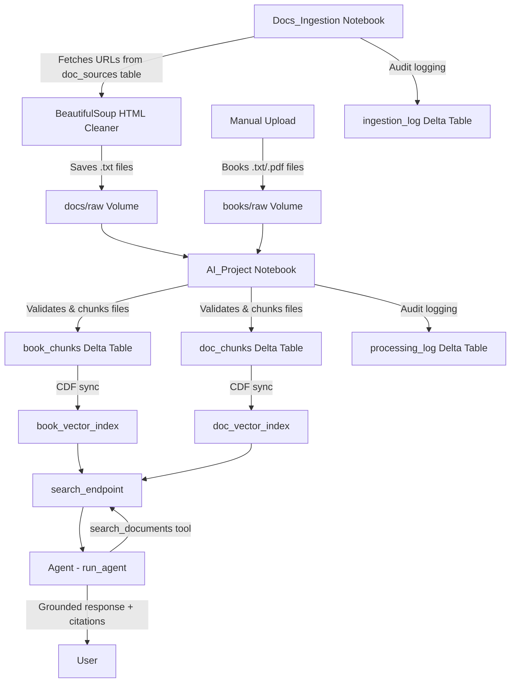

# Databricks AI Project

A documentation-grounded Data Engineering Copilot built on Databricks Free Edition. This project combines RAG (Retrieval-Augmented Generation), vector search, and agentic tool calling to create an assistant that retrieves technical documentation and generates grounded, actionable responses — including working code.

---

## What It Does

- **Ingests and indexes** technical documentation (Databricks, Unity Catalog, Spark SQL) and literary sources (via Project Gutenberg)
- **Chunks and embeds** source content into a Databricks Vector Search index using the `databricks-bge-large-en` embedding model
- **Routes queries** to the correct vector index based on source type (`books` or `docs`)
- **Generates grounded responses** using `databricks-meta-llama-3-1-405b-instruct`, citing the exact source file and location
- **Maintains conversation memory** across a session via chat history
- **Logs all pipeline activity** to audit tables for observability

---

## Architecture



---

## Project Structure

```
databricks-ai-project/
├── AI_Project              # Main pipeline notebook
├── Docs_Ingestion          # Documentation fetching notebook
├── utils/
│   ├── logging_utils       # Shared audit logging functions
│   └── search_utils        # Shared vector search functions
└── DDL/
    ├── ai_project.sql      # Schema creation
    ├── raw_data.sql        # Volume creation
    └── Tables/
        ├── book_chunks.sql
        ├── doc_chunks.sql
        ├── processing_log.sql
        ├── doc_sources.sql
        └── ingestion_log.sql
```

### Volume Structure

```
raw_data/
├── books/
│   ├── raw/            # Drop source book files here
│   └── processed/      # Processed files moved here automatically
└── docs/
    ├── raw/            # Fetched documentation files land here
    └── processed/      # Processed files moved here automatically
```

---

## Unity Catalog Objects

| Object | Type | Description |
|--------|------|-------------|
| `workspace.ai_project` | Schema | Project schema |
| `workspace.ai_project.raw_data` | Volume | File storage for books and docs |
| `workspace.ai_project.book_chunks` | Delta Table | Chunked text from book sources |
| `workspace.ai_project.doc_chunks` | Delta Table | Chunked text from documentation |
| `workspace.ai_project.processing_log` | Delta Table | Audit log for file → chunk processing |
| `workspace.ai_project.doc_sources` | Delta Table | Directory of documentation URLs |
| `workspace.ai_project.ingestion_log` | Delta Table | Audit log for URL fetching |
| `search_endpoint` | Vector Search Endpoint | Serves all vector indexes |
| `workspace.ai_project.book_vector_index` | Vector Search Index | Indexes book_chunks |
| `workspace.ai_project.doc_vector_index` | Vector Search Index | Indexes doc_chunks |

---

## Setup Instructions

### Prerequisites

- Databricks Free Edition workspace
- Python packages (see `requirements.txt`)
- Unity Catalog enabled on your workspace

### First Time Setup

1. **Clone the repository** into your Databricks workspace

2. **Run the DDL files** in order:
   ```sql
   -- 1. Create schema and volume
   DDL/ai_project.sql
   DDL/raw_data.sql

   -- 2. Create tables
   DDL/Tables/book_chunks.sql
   DDL/Tables/doc_chunks.sql
   DDL/Tables/processing_log.sql
   DDL/Tables/doc_sources.sql
   DDL/Tables/ingestion_log.sql
   ```

3. **Create the Volume folder structure** manually in the Databricks UI:
   ```
   raw_data/books/raw/
   raw_data/books/processed/
   raw_data/docs/raw/
   raw_data/docs/processed/
   ```

4. **Populate doc_sources** with your documentation URLs:
   ```sql
   INSERT INTO workspace.ai_project.doc_sources
       (url, topic, title, active, date_added, last_fetched)
   VALUES
       ('https://docs.databricks.com/aws/en/tables/', 'Delta Lake', 'Delta Lake Tables Overview', true, current_timestamp(), null),
       -- add more URLs as needed
   ```

5. **Install dependencies**:
   ```python
   %pip install -r https://raw.githubusercontent.com/seaninc-training/databricks-ai-project/main/requirements.txt
   ```

---

## How to Run

### Ingesting Documentation

Run `Docs_Ingestion` notebook top to bottom. It will:
- Query `doc_sources` for active URLs
- Fetch and clean each page
- Save as `.txt` files to `docs/raw/`
- Log each fetch to `ingestion_log`

### Running the Full Pipeline

Run `AI_Project` notebook top to bottom:

| Cell | Description |
|------|-------------|
| Cell 1 | Imports and variable setup |
| Cell 2 | Initialize logging utils |
| Cell 3 | Initialize search utils |
| Cell 4 | Validate and collect files from raw folders |
| Cell 5 | Chunk files and write to Delta tables |
| Cell 6 | Create/sync vector search endpoint and indexes |
| Cell 7 | Run diagnostic search (configurable) |
| Cell 8 | Initialize agent and tool schema |
| Cell 9 | Define `run_agent()` function |
| Cell 10 | Run agent with a query |

> **Note:** On first run, Cell 6 will create the vector search endpoint and indexes. Initial indexing of large files (e.g. full novels) can take 15-25 minutes. Subsequent runs skip creation and only sync when new files are detected.

### Adding Books

Drop `.txt` or `.pdf` files into `raw_data/books/raw/` via the Databricks Volume UI, then rerun `AI_Project`.

---

## Example Agent Queries

```python
# Literary question (routes to book_vector_index)
run_agent("What weapon did Raskolnikov use to commit the crime?")

# Technical question (routes to doc_vector_index)
run_agent("How do I create a managed table in Databricks?")
```

---

## Tech Stack

| Component | Technology |
|-----------|-----------|
| Platform | Databricks Free Edition |
| Orchestration | Databricks Notebooks |
| Storage | Delta Lake + Unity Catalog Volumes |
| Chunking | LangChain RecursiveCharacterTextSplitter |
| Embeddings | databricks-bge-large-en |
| Vector Search | Databricks Mosaic AI Vector Search |
| LLM | databricks-meta-llama-3-1-405b-instruct |
| Agent Framework | OpenAI-compatible API + manual tool loop |
| HTML Parsing | BeautifulSoup4 |

---

## Roadmap

- [ ] REST API-based documentation retrieval (replace BeautifulSoup for JS-rendered pages)
- [ ] `generate_code` agent tool — generates pipeline code grounded in retrieved docs
- [ ] `execute_in_databricks` agent tool — executes generated code with user confirmation step
- [ ] Personal data tracker (books read, music collection) using GitHub-hosted CSV as source
- [ ] Databricks Workflow for scheduled doc refresh
- [ ] Separate notebooks per pipeline stage

---

## Author

Sean | [GitHub](https://github.com/seaninc-training)